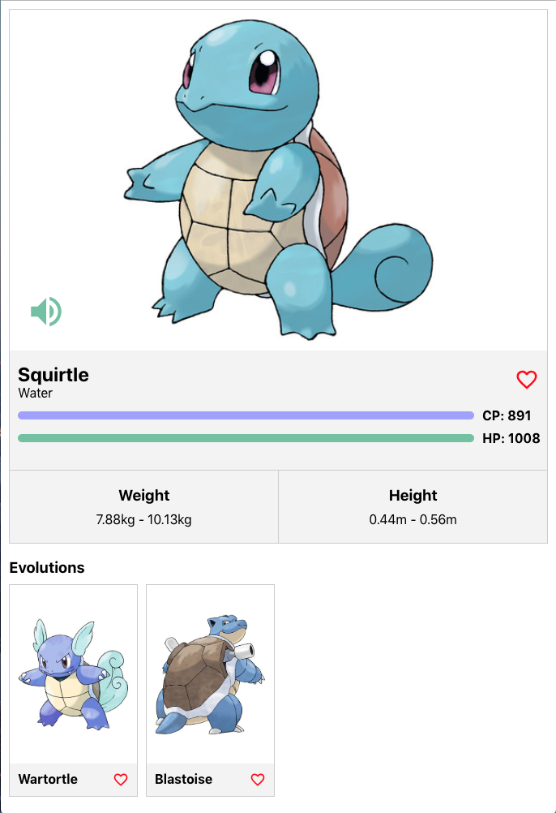

# Coding Challenge: pokedex client side 

This repository contains a coding exercise for new developers joining the frontend development team. This version is focused in React.

## 01. System Requirements


- [Git](https://git-scm.com/book/en/v2/Getting-Started-Installing-Git) v2.13 or greater

- You’ll need to have [Node](https://nodejs.org/de/download/) >= 14.0.0 and npm >= 5.6 on your machine.


** All of these must be available in your PATH. To verify things are set up properly, you can run this:

```
git --version
node --version
npm --version
```

## 02. What we want you to build


Your mission is to build a small Pokedex app that show to next mock web application:




** NOTE: App mockups and a video example can be found in the [example-pokedex-client](example-pokedex-client) folder in the root of the directory as example.mov

## 03. Some expect features


These are some of the features you should expect in you repositorie: 

- Retrieve All Pokemons.
- Show Pokemon details.
- Search for Pokemon by text (Mainly "Pokemon Name").
- Filter Pokemon by type.
- Add and remove a Pokemon to and from your Favorites.
- Retrieve All Favorite Pokemons.


## 04. What we provide to do the Coding Challenge


### A. **GraphQL Server**

We have provided you with a simple GraphQL server that serves Pokemon data. WARNING: The server is non-persistent and therefore on server restart, data will reset.

**To run the server:**

```
$ cd graphql-pokemon-server
$ npm install
$ npm start
```

After running the backend, you can access https://localhost:4000/graphql in the browser, you'll be presented with a GraphQL Playground that allows you to run Queries and Mutations as well. So you are going to see the GraphQL Schema.

A sample query:

```
query { pokemons(query: { limit: 10, offset: 0 }) { edges { name } } }
```
 

### B. **Bootstrapping you client app**

Feel free, to bootstrap your app as you want. We recomend [Create React App](https://reactjs.org/docs/create-a-new-react-app.html#create-react-app). You are free to use whatever stack you want but what we value the most is [React](https://reactjs.org/)

Use only what you are comfortable with and feel free to use any additional libraries you deem necessary to complete the exercise. We would like to see your model designer skills so make sure you show them to us! (You can use any NPM dependency).

## 05. Coding the solucion

Fork this repository and create your own exercise, after that launch the setup!

```
IMPORTANT: If you want to commit and push your work as you go, you'll want to fork first and then clone your fork rather than this repo directly.
```

When you are ready to start, pleasy put you code in [/pokedex-client](pokedex-client).

Enjoy!!

## 06. Extra point

-  [Thinking in React](https://reactjs.org/docs/thinking-in-react.html)