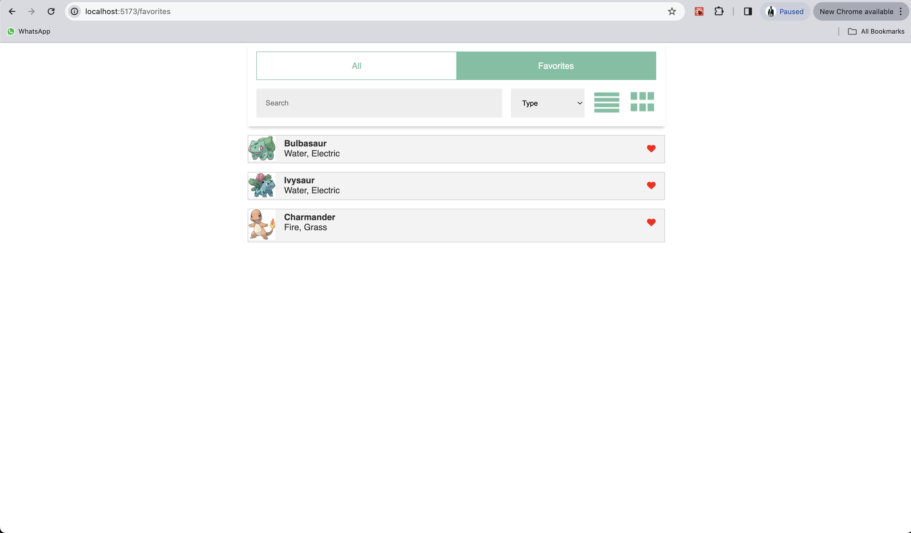

**Disclaimer**

The details page is not as identical to the designs because server does not return some of the data to the front end which needs to rendered on details page therefore, I only add information which the server returns.

Secondly, since the design is only for small devices therefore, I assumed that it is only for ipad/tablet screens and I only tested it on these screens. It might not completely look good on larger or mobile screens. And there were no requirements whether to implement responsive design.

# Folder structure

Below is the entire folder structure.

```
.
├── README.md
├── index.html
├── package.json
├── public
│   └── vite.svg
├── src
│   ├── App.css
│   ├── App.tsx
│   ├── assets
│   │   └── react.svg
│   ├── components
│   │   ├── all-views
│   │   │   ├── grid
│   │   │   │   ├── grid.styles.tsx
│   │   │   │   ├── grid.tsx
│   │   │   │   └── index.tsx
│   │   │   └── list
│   │   │       ├── index.tsx
│   │   │       ├── list.styles.tsx
│   │   │       └── list.tsx
│   │   ├── header
│   │   │   ├── assets
│   │   │   │   ├── grid.webp
│   │   │   │   └── list.webp
│   │   │   ├── header.styles.tsx
│   │   │   ├── header.tsx
│   │   │   └── index.tsx
│   │   ├── layout
│   │   │   ├── index.tsx
│   │   │   ├── layout.styles.tsx
│   │   │   └── layout.tsx
│   │   ├── navigation
│   │   │   ├── index.tsx
│   │   │   ├── navigation.styles.tsx
│   │   │   └── navigation.tsx
│   │   ├── search
│   │   │   ├── index.tsx
│   │   │   ├── search.styles.tsx
│   │   │   └── search.tsx
│   │   └── types
│   │       ├── index.tsx
│   │       ├── types.styles.tsx
│   │       └── types.tsx
│   ├── context
│   │   └── mainContext.tsx
│   ├── index.css
│   ├── interfaces.tsx
│   ├── main.tsx
│   ├── pages
│   │   ├── favorites
│   │   │   ├── favorites.tsx
│   │   │   └── index.tsx
│   │   ├── pokemon-detail
│   │   │   ├── detail.styles.tsx
│   │   │   ├── detail.tsx
│   │   │   └── index.tsx
│   │   └── pokemon-items
│   │       ├── index.tsx
│   │       └── pokemon-items.tsx
│   ├── routes.tsx
│   ├── theme
│   │   ├── globals.ts
│   │   ├── index.ts
│   │   ├── screens
│   │   │   ├── breakpoints.ts
│   │   │   └── index.ts
│   │   ├── theme.ts
│   │   ├── tokens
│   │   │   ├── colors.ts
│   │   │   ├── gutter.ts
│   │   │   ├── index.ts
│   │   │   ├── palette.ts
│   │   │   └── sizes.ts
│   │   └── typography
│   │       ├── index.ts
│   │       └── typography.ts
│   ├── utils
│   │   └── render-view.tsx
│   └── vite-env.d.ts
├── tsconfig.json
├── tsconfig.node.json
├── vite.config.ts
└── yarn.lock
```

## Introduction

I used `vite` to create this project as according to official `react documentation` `CRA` seems to be not the way to go with anymore. So I had few options such as setting up the entire project myself from scratch or make use of tool such as `vite`. I decided `vite` because it provides better developer experience due to lightning fast `dev` environment and `build` process etc. Secondly, it is already used in several production level projects by many startups therefore, it is way more reliable.

`App.tsx` file mainly serves as `routes` file and I am initialising `Apollo Client` in `main.tsx` so that I have access to all of `Apollo Client` hooks in child pages and components. I decided to use `Apollo Client` as a API manager layer due to its advance caching mechanism which is perfect for better performance and better UX.

For routing, I made use of `react-router-dom` as it is a standard library for routing and one of the requirement of this task was that users should be able to open `detail page` using url and `react-router-dom` serves that purpose very well.

Moreover, I used `Styled-Components` for styling which allows to write `CSS-in-JS`. In addition, writing theme based CSS using `Styled-components` is way more approachable than vanilla CSS.

I also used code splitting concept by using `React Suspense` and lazy loading features. Code splitting allows to download components on demand rather than downloading the entire app from on first request.

There are 3 main folders that needs to be taken into consideration during evaluation which are following.

1. components
2. pages
3. styles
4. Context API

### components

Components folder has global components that are used in all over the project. Some of the components I implemented are `grid` and `list` views, `header`, `layout`, `navigation`, `search` & `types`.

### pages

This folder contains all(`favorites`, `pokemon-items` & `pokemon-details`) pages.

### styles

Theme contains all of the global styles and variables such as `branding`, `typography`, `gutters` i.e. `spacing` & `gaps` etc. I decided this approach to make it developer friendly & leave less amount of technical debt for future.

### Context

I decided to use context API for global state management. And all of the logic, retrieving data from server, `favorite` & `unFavorite`, searching features logic is implemented inside global context.

## Some more decisions

I decided to use TypeScript to make this project typesafe which allows to avoid common errors & bugs.

## How to run

To install dependencies use below commands.

```bash
cd pokedex-client/app
yarn
```

To run locally.

```bash
cd pokedex-client/app
yarn dev
```

## Technolgical Stack

1. TypeScript
2. React
3. Vite
4. Git
5. Styled-Components
4. Context API
5. Lodash

## Here is how it looks like.





